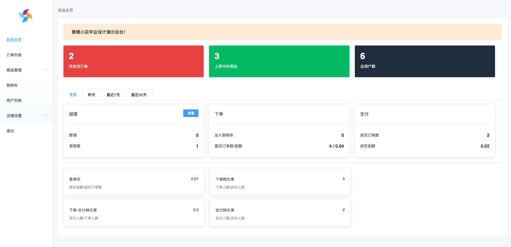
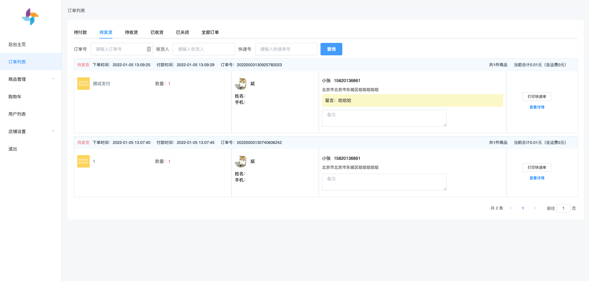
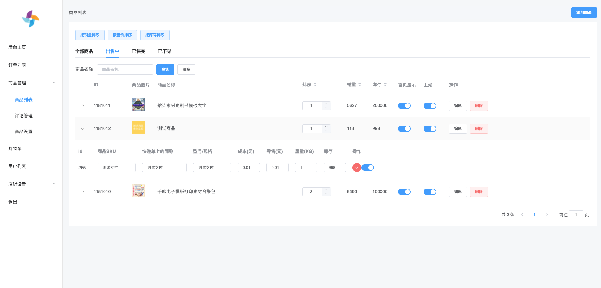
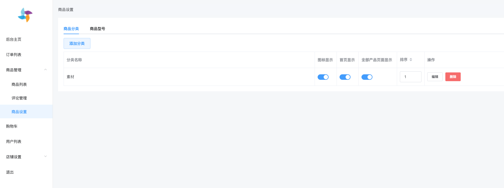
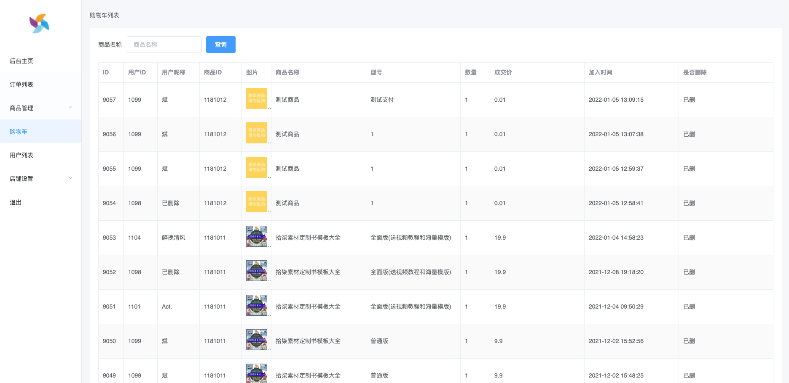
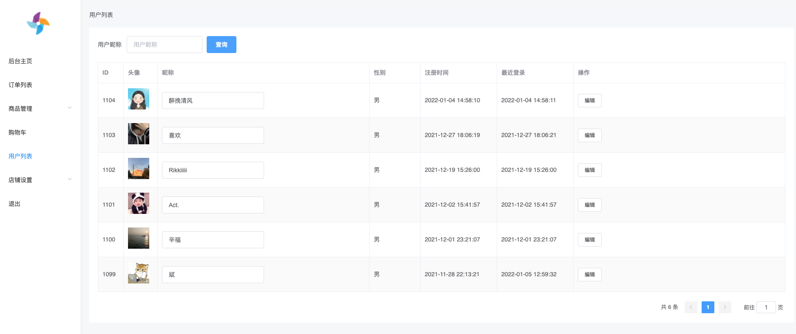
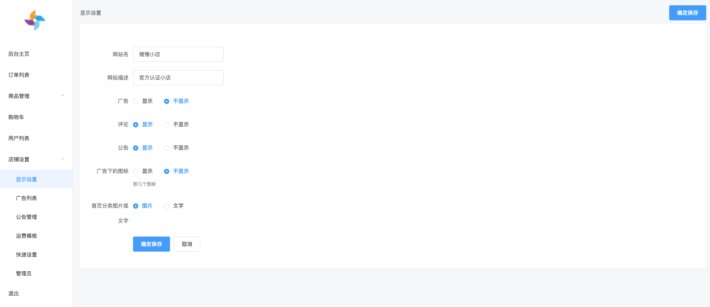

### 猪猪小店，开源微信商城（Element+Vue 后台管理端）

- 基于开源项目 NideShop 和海风小店重建，参考的这两个项目的时间都有点久，有一些小问题，因此我精简了一些功能，同时完善修复
  了一些 bug，并重新设计了 UI，目前已发布上线，使用中～
- 服务端 api 基于 Node.js+ThinkJS+MySQL
- 后台管理端 基于 VUE.js+element-ui、
- 小程序端 基于原生小程序开发
- 目前微信登录、支付，快递查询均正常使用

### 目前猪猪小店已经上线，可以扫码测试看看


#### 本项目需要配合

服务端： https://github.com/zxb1655/xzzshop-server  
微信小程序：https://github.com/zxb1655/xzzshop-miniprogram

### 项目截图

- 后台首页



- 订单



- 商品管理



- 商品分类



- 购物车



- 用户



- 店铺设置



### 本地开发环境配置

- 克隆项目到本地

```
git clone https://github.com/zxb1655/xzzshop-admin
```

- 安装依赖

```
yarn
```

- 启动

```
yarn serve
```

- build 打包成静态文件

```
yarn build 或者 yarn build:test
```

生成的静态文件在 dist 文件夹中，上传到服务器就可以在浏览器中打开了。

### 功能列表

- 订单管理：查看，修改订单价格，发货，生成电子面单，修改订单状态
- 商品管理：添加、修改、删除商品，添加商品分类，添加商品评论
- 购物车：可以看到用户加入购物车的情况
- 用户列表：用户的一些使用踪迹
- 店铺设置：显示设置，广告列表，公告管理，运费模板（可以根据地区设置相应的运费），快递设置，管理员

### 最后说明

- 项目地址

  后台管理：https://github.com/zxb1655/xzzshop-admin  
  服务端： https://github.com/zxb1655/xzzshop-server  
  微信小程序：https://github.com/zxb1655/xzzshop-miniprogram

- 本项目会持续更新和维护，有问题可通过微信联系我，喜欢别忘了 Star 一下哦，谢谢您的关注。
  
